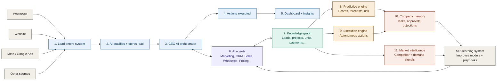
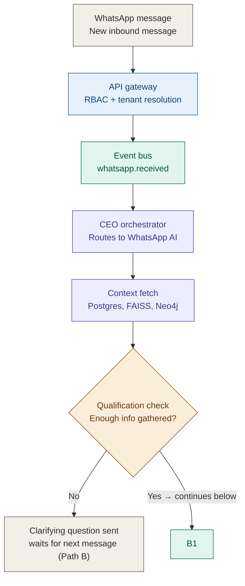
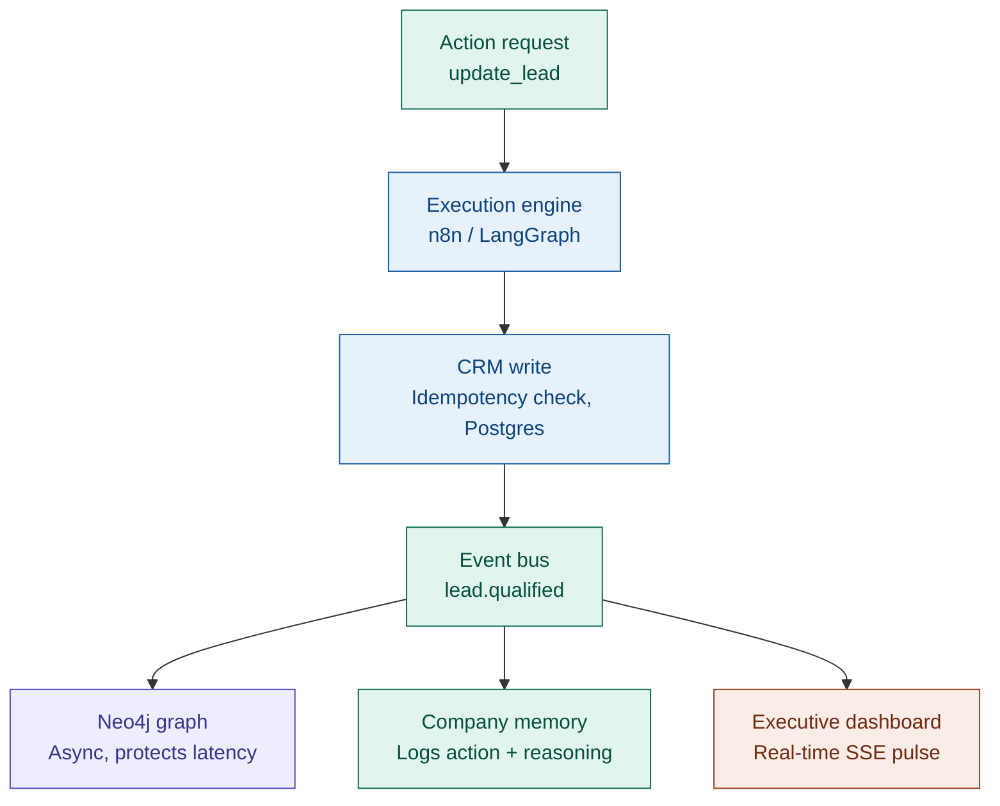
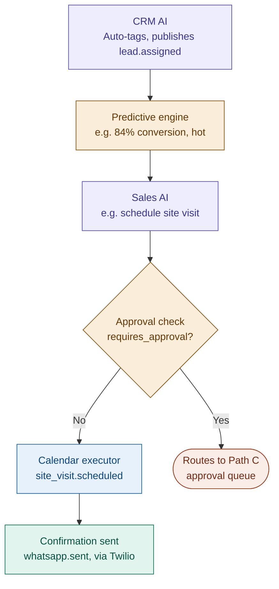
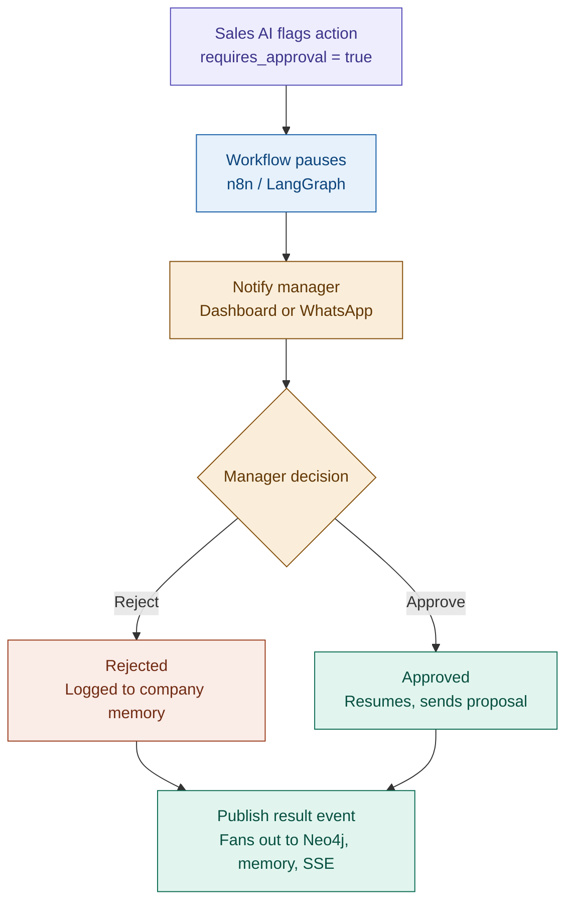
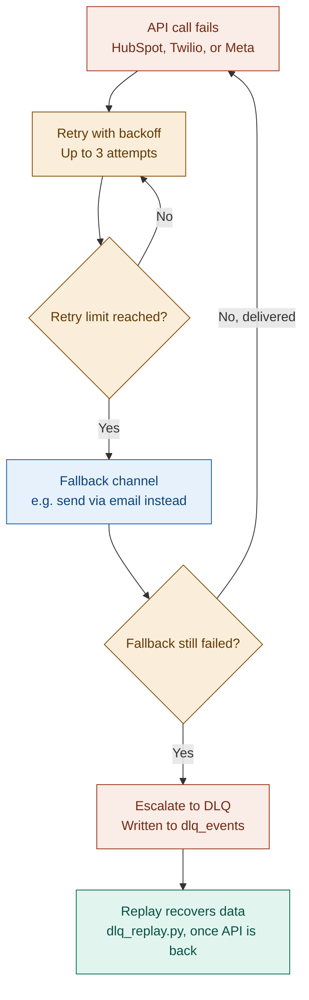
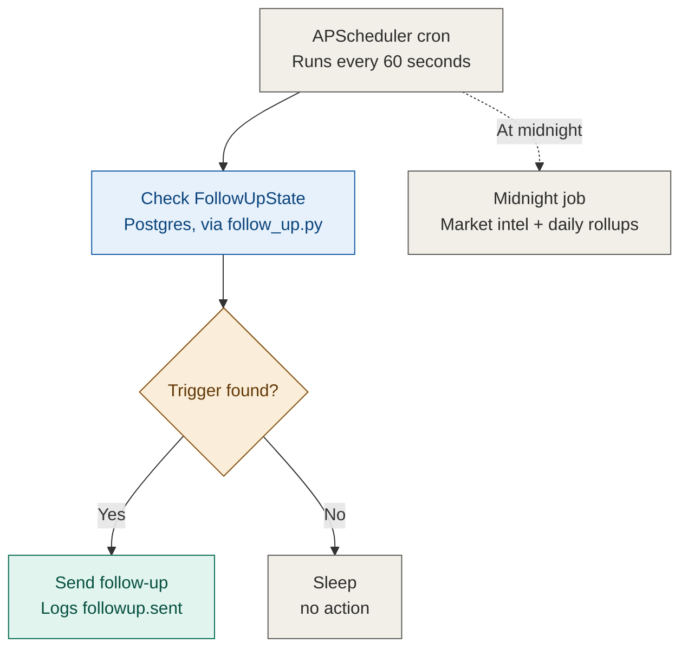

# IREIOS 3.0 — Multi-Agent Event-Driven Architecture

Compiled reference diagrams for the IREIOS platform (Phase 3.0), covering the system
overview and all five execution paths (A–E). Diagrams use [Mermaid](https://mermaid.js.org),
which renders natively on GitHub, GitLab, Notion, and most static site generators. In VS Code,
install the **"Markdown Preview Mermaid Support"** extension to preview locally, or paste any
block into [mermaid.live](https://mermaid.live).

## Legend

| Color | Meaning |
|---|---|
| Gray | Infrastructure / triggers / neutral steps |
| Blue | Data & execution layer (writes, engines) |
| Teal | Events / message bus |
| Purple | AI agents |
| Amber | Decision points / scoring |
| Coral | Fan-out targets / failure / escalation |

---

## System overview (Layers 1–11)



---

## Path A — Lead intake & qualification (happy path, part 1)



## Path A — Qualified lead fan-out (part 2)



## Path A — Scoring to confirmation (part 3)



## Path B — Multi-turn conversation

Path B is not a separate branch — every new WhatsApp message re-enters **Path A** at the top.
The only difference is that Context Fetch pulls short-term memory (previous questions asked)
and company memory (previously extracted intent), so the WhatsApp AI skips fields it already
has and only asks for what's missing. This loop continues until the qualification check in
Path A part 1 returns "Yes."

---

## Path C — Human-in-the-loop approval (Maitri's automation engine)



---

## Path D — Disaster recovery (execution failure)



---

## Path E — Scheduled / background work (proactive engine)



---

## Appendix — Original architecture reference (source ASCII diagram)

```text
IREIOS 3.0 — MULTI-AGENT EVENT-DRIVEN ARCHITECTURE (REFINED)
────────────────────────────────────────────────────────────

PATH A — New lead, straightforward qualification (Happy Path)
────────────────────────────────────────────────────────────
WhatsApp message
  ↓
API Gateway → RBAC / API Key Validation → resolves client_id + tenant
  ↓
Publish event: `whatsapp.received` → Central Event Bus (Kafka/Redis)
  ↓
CEO AI Orchestrator (Layer 1) → Routes task to WhatsApp AI (Layer 2)
  ↓
Context Fetch (Layer 3 & 9):
      ├─ Postgres (Current transactional state — Source of Truth)
      ├─ FAISS (Past conversation vector history)
      └─ Neo4j (Entity relationships: Lead → Project → Unit)
  ↓
WhatsApp AI extracts intent (budget, location, unit type, objections)
  ↓
Enough info to qualify?
  ├── NO  → Generates clarifying question → WhatsApp Executor → (Ends, waits for Path B)
  └── YES → continue below
  ↓
Action Request: `update_lead`
  ↓
Execution / Automation Engine (n8n / LangGraph)
  ↓
Idempotency check → CRM Executor writes to Postgres (Transactional)
  ↓
Publish event: `lead.qualified` → Central Event Bus
  ↓
        ┌────────────────────────┬────────────────────────┬────────────────────────┐
        ▼                        ▼                        ▼
  Neo4j Knowledge Graph    Company Memory (Layer 9)   Executive Dashboard (Layer 11)
  (STRICTLY ASYNC to       (Logs the action PLUS      (Pushes real-time SSE pulse
  protect chat latency)    objections & AI reasoning) to UI / Digital Twin / Timeline)
        └────────────────────────┴────────────────────────┴────────────────────────┘
  ↓
CRM AI (Layer 2): Auto-tags, routes to human agent → publishes `lead.assigned`
  ↓
Predictive Engine (Layer 4): Calculates Lead Conversion Score (e.g., 84% / Hot)
  ↓
Sales AI (Layer 2): Determines Next Best Action (e.g., "Schedule site visit for Tower B")
  ↓
requires_approval?
  ├── YES → Routes to Approval Queue (Human-in-the-loop — See Path C)
  └── NO  → continue below
  ↓
Execution Engine (n8n / LangGraph) → Calendar Executor → `site_visit.scheduled`
  ↓
WhatsApp AI generates confirmation → WhatsApp Executor sends via Twilio
  ↓
Publish event: `whatsapp.sent` → Event Bus → SSE → AI Timeline UI


PATH B — Multi-turn conversation (Info gathered over several messages)
────────────────────────────────────────────────────────────
Each new WhatsApp message triggers `whatsapp.received` and re-enters Path A.
  ↓
Context Fetch pulls "Short-Term Memory" (previous questions asked) and
"Company Memory" (previously extracted intent).
  ↓
WhatsApp AI realizes it already has [Location] and only asks for [Budget].
  ↓
Loop continues until qualification criteria are met → joins Path A at "Action Request".


PATH C — Action needs human approval (Maitri's Automation Engine)
────────────────────────────────────────────────────────────
Sales AI suggests action flagged `requires_approval = true` (e.g., 10% Discount Offer)
  ↓
LangGraph / n8n workflow pauses → Sends notification to Manager (Dashboard / WhatsApp)
  ↓
Manager Decision:
  ├── REJECTED → Action logged to Company Memory ("Manager denied discount"), flow resumes.
  └── APPROVED → Execution Engine resumes → generates proposal → sends to client.
  ↓
Publish result event → Event Bus → Fan-out to Neo4j, Memory, and SSE Dashboard.


PATH D — Execution Fails (Disaster Recovery)
────────────────────────────────────────────────────────────
Execution Engine attempts API call (HubSpot, Twilio, Meta) → Fails
  ↓
Native Retry with exponential backoff (e.g., 3 attempts)
  ↓
Retry limit reached?
  ├── NO  → Retry again
  └── YES → Fallback logic (e.g., send via Email instead)
             ↓
        Still failed? → Escalate → Write to Dead Letter Queue (dlq_events)
             ↓
        `python dlq_replay.py` safely recovers data when API comes back online.


PATH E — Scheduled / Background Work (Proactive Engine)
────────────────────────────────────────────────────────────
APScheduler (Cron-based, operating outside the real-time Event Bus)
  ↓
Every 60s: `follow_up.py` checks Postgres `FollowUpState`
  ├── Trigger found → generates AI payload → sends message → logs `followup.sent` to Event Bus
  └── No trigger → sleeps
  ↓
Midnight: Triggers AI Market Intelligence (Layer 10) and Daily Rollups.
```